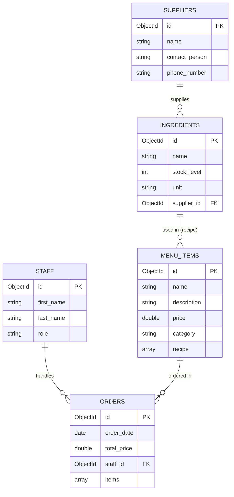

# 🍔 Chrome Burger Database System (`chrome-burger-db-jsd13`)

ระบบฐานข้อมูลจำลองของร้านเบอร์เกอร์ **Chrome Burger** พัฒนาขึ้นโดยใช้ MongoDB สำหรับเก็บข้อมูลและจัดการระบบร้านค้า เช่น ข้อมูลซัพพลายเออร์, พนักงาน, วัตถุดิบ, เมนูอาหาร และการสั่งซื้อ

---

## 🗺️ แผนภาพความสัมพันธ์ของข้อมูล (Data Relationships)

ใน MongoDB ซึ่งเป็น Document Database ถึงแม้จะไม่ใช่ Relational Database (RDBMS) แต่เราสามารถเชื่อมโยงข้อมูลกันผ่าน Reference (`ObjectId`) ได้ ดังนี้:



---

## 📂 โครงสร้างโปรเจกต์ (Project Files)

โปรเจกต์นี้ประกอบไปด้วยสคริปต์ MongoDB (`.mongodb.js`) จำนวน 5 ไฟล์ ซึ่งจะทำงานตามลำดับดังนี้:

1. 🏢 **[01_suppliers.mongodb.js](file:///C:/coding/jsd13/week-02/first-meet-dbs/mongodb/chorme-burger-db/01_suppliers.mongodb.js)**: จัดการและใส่ข้อมูลบริษัทคู่ค้า/ผู้จัดจำหน่ายวัตถุดิบ (Suppliers)
2. 👥 **[02_staff.mongodb.js](file:///C:/coding/jsd13/week-02/first-meet-dbs/mongodb/chorme-burger-db/02_staff.mongodb.js)**: จัดการและใส่ข้อมูลพนักงานของร้าน เช่น แคชเชียร์ และคนครัว (Staff)
3. 🥬 **[03_ingredients.mongodb.js](file:///C:/coding/jsd13/week-02/first-meet-dbs/mongodb/chorme-burger-db/03_ingredients.mongodb.js)**: จัดการข้อมูลคลังวัตถุดิบและลิงก์ไปยังผู้จัดจำหน่าย (Ingredients)
4. 📜 **[04_menu.mongodb.js](file:///C:/coding/jsd13/week-02/first-meet-dbs/mongodb/chorme-burger-db/04_menu.mongodb.js)**: จัดการข้อมูลเมนูอาหาร พร้อมกำหนดสูตรอาหารที่อ้างอิงกับวัตถุดิบ (Menu Items)
5. 🛒 **[05_order.mongodb.js](file:///C:/coding/jsd13/week-02/first-meet-dbs/mongodb/chorme-burger-db/05_order.mongodb.js)**: จำลองการสั่งซื้ออาหาร ลิงก์ข้อมูลเมนู พนักงาน และตัวอย่างการใช้ Aggregation Pipeline เพื่อ Query ข้อมูลออกมาแสดงผล

---

## 🔍 โครงสร้าง Collection (Schemas Details)

### 1. `suppliers` (ผู้จัดจำหน่าย)
เก็บข้อมูลผู้จัดจำหน่ายสำหรับสั่งซื้อวัตถุดิบ
* ดูโค้ดได้ที่: [01_suppliers.mongodb.js](file:///C:/coding/jsd13/week-02/first-meet-dbs/mongodb/chorme-burger-db/01_suppliers.mongodb.js)

| Field | Type | Description | Example |
| :--- | :--- | :--- | :--- |
| `_id` | ObjectId | คีย์หลัก (Primary Key) | `65f000000000000000000001` |
| `name` | String | ชื่อบริษัทผู้จัดจำหน่าย | `"Patty's Premium Meats"` |
| `contact_person` | String | ชื่อผู้ติดต่อประสานงาน | `"Patty Smith"` |
| `phone_number` | String | เบอร์โทรศัพท์ติดต่อ | `"555-0101"` |

### 2. `staff` (พนักงาน)
เก็บข้อมูลพนักงานและตำแหน่งหน้าที่
* ดูโค้ดได้ที่: [02_staff.mongodb.js](file:///C:/coding/jsd13/week-02/first-meet-dbs/mongodb/chorme-burger-db/02_staff.mongodb.js)

| Field | Type | Description | Example |
| :--- | :--- | :--- | :--- |
| `_id` | ObjectId | คีย์หลัก (Primary Key) | `65f100000000000000000001` |
| `first_name` | String | ชื่อจริง | `"Jane"` |
| `last_name` | String | นามสกุล | `"Doe"` |
| `role` | String | บทบาท/ตำแหน่ง (เช่น Cashier, Cook) | `"Cashier"` |

### 3. `ingredients` (วัตถุดิบ)
เก็บข้อมูลวัตถุดิบ จำนวนคงเหลือในคลัง และการอ้างอิงไปยังผู้จัดจำหน่าย
* ดูโค้ดได้ที่: [03_ingredients.mongodb.js](file:///C:/coding/jsd13/week-02/first-meet-dbs/mongodb/chorme-burger-db/03_ingredients.mongodb.js)

| Field | Type | Description | Example |
| :--- | :--- | :--- | :--- |
| `_id` | ObjectId | คีย์หลัก (Primary Key) | `65f200000000000000000001` |
| `name` | String | ชื่อวัตถุดิบ | `"Beef Patty"` |
| `stock_level` | Number | จำนวนวัตถุดิบคงเหลือ | `50` |
| `unit` | String | หน่วยนับ (เช่น pcs, heads) | `"pcs"` |
| `supplier_id` | ObjectId | ไอดีของ Supplier ที่จัดหาวัตถุดิบนี้ | `ObjectId("65f000000000000000000001")` |

### 4. `menu_items` (รายการเมนูอาหาร)
เก็บข้อมูลเมนูของร้าน ราคา และสูตรอาหาร (Recipe) ซึ่งเป็น Array ของวัตถุดิบที่ต้องใช้
* ดูโค้ดได้ที่: [04_menu.mongodb.js](file:///C:/coding/jsd13/week-02/first-meet-dbs/mongodb/chorme-burger-db/04_menu.mongodb.js)

| Field | Type | Description | Example |
| :--- | :--- | :--- | :--- |
| `_id` | ObjectId | คีย์หลัก (Primary Key) | `65f300000000000000000001` |
| `name` | String | ชื่อเมนูอาหาร | `"Classic Burger"` |
| `description` | String | คำอธิบายรายละเอียดเมนู | `"Classic beef burger with lettuce and tomato"` |
| `price` | Number | ราคาขาย | `9.99` |
| `category` | String | หมวดหมู่เมนู | `"Burgers"` |
| `recipe` | Array | รายการวัตถุดิบและปริมาณที่ต้องใช้ (ประกอบด้วย `ingredient_id` และ `quantity_needed`) | `[{ ingredient_id: ..., quantity_needed: 1 }]` |

### 5. `orders` (การสั่งซื้อ)
เก็บประวัติการสั่งซื้ออาหาร รายการสินค้าที่สั่ง และพนักงานที่ดูแลรับออเดอร์
* ดูโค้ดได้ที่: [05_order.mongodb.js](file:///C:/coding/jsd13/week-02/first-meet-dbs/mongodb/chorme-burger-db/05_order.mongodb.js)

| Field | Type | Description | Example |
| :--- | :--- | :--- | :--- |
| `_id` | ObjectId | คีย์หลัก (Primary Key) | `65f400000000000000000001` |
| `order_date` | Date | วันเวลาที่สั่งซื้อ | `2024-03-15T12:30:00Z` |
| `total_price` | Number | ราคารวมทั้งหมด | `19.98` |
| `staff_id` | ObjectId | ไอดีพนักงานที่ทำรายการ | `ObjectId("65f100000000000000000001")` |
| `items` | Array | รายการอาหารที่สั่งซื้อ (ประกอบด้วย `menu_item_id`, `name`, `price`, `quantity`) | `[{ menu_item_id: ..., name: "Classic Burger", price: 9.99, quantity: 2 }]` |

---

## 🚀 วิธีการใช้งาน (How to run)

คุณสามารถนำไฟล์สคริปต์เหล่านี้ไปรันในสภาพแวดล้อมต่าง ๆ ได้ดังนี้:

### วิธีการรันผ่าน VS Code ด้วย MongoDB VS Code Extension (แนะนำ)

1. ติดตั้งส่วนขยาย **MongoDB for VS Code** ใน VS Code
2. เชื่อมต่อเข้ากับ MongoDB Connection String ของคุณ (เช่น `mongodb://localhost:27017` หรือ MongoDB Atlas)
3. เปิดไฟล์เรียงตามลำดับ `01_suppliers.mongodb.js` ถึง `05_order.mongodb.js`
4. คลิกปุ่ม ⏩ **"Play"** (หรือกดปุ่ม `Ctrl + Alt + E` / `Cmd + Option + E`) เพื่อรันสคริปต์

### วิธีการรันผ่าน MongoDB Shell (`mongosh`)

สามารถรันผ่านเทอร์มินัลด้วยคำสั่ง:

```bash
mongosh "mongodb://localhost:27017/chrome-burger-db-jsd13" 01_suppliers.mongodb.js
mongosh "mongodb://localhost:27017/chrome-burger-db-jsd13" 02_staff.mongodb.js
mongosh "mongodb://localhost:27017/chrome-burger-db-jsd13" 03_ingredients.mongodb.js
mongosh "mongodb://localhost:27017/chrome-burger-db-jsd13" 04_menu.mongodb.js
mongosh "mongodb://localhost:27017/chrome-burger-db-jsd13" 05_order.mongodb.js
```

---

## 📈 ตัวอย่างการ Query แบบ Aggregation (Join ข้อมูล)

ในไฟล์ [05_order.mongodb.js](file:///C:/coding/jsd13/week-02/first-meet-dbs/mongodb/chorme-burger-db/05_order.mongodb.js) มีตัวอย่างการเชื่อมข้อมูลระหว่าง `orders` และ `staff` โดยใช้ `$lookup` และ `$unwind`:

```javascript
db.orders.aggregate([
  {
    $lookup: {
      from: "staff",          // คอลเลกชันเป้าหมายที่ต้องการดึงข้อมูลมาเชื่อม
      localField: "staff_id",  // ฟิลด์ใน orders ที่ใช้เชื่อม
      foreignField: "_id",     // ฟิลด์ใน staff ที่ใช้เชื่อม
      as: "staff_info"         // ชื่อฟิลด์ผลลัพธ์ที่จะเก็บข้อมูล
    }
  },
  {
    $unwind: "$staff_info"     // แปลง Array จาก lookup ให้เป็น Object
  }
]);
```
